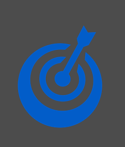

# Focalboard
by Dimas Zainal Muttaqin (19081010012)

Focalboard adalah alternatif open source untuk alat seperti Asana, Trello, dan Notion. Tersedia sebagai aplikasi yang berdiri sendiri atau terintegrasi ke dalam platform Mattermost, Focalboard membantu pengembang tetap selaras untuk menyelesaikan tugas, mencapai pencapaian, dan mencapai tujuan mereka.

## Instalasi Focalboard
1. Download software focalboard bisa klik link di samping (https://www.microsoft.com/store/productId/9NLN2T0SX9VF)

2. Setelah selesai mendownload buka software focalboard.

ada beberapa pilihan dalam dashboard focalboard diantaranya :
1. Content Calendar
- Content calendar adalah alat penting untuk mengorganisir perencanaan terkait publikasi konten, baik itu untuk campaign maupun artikel di halaman website. Umumnya, alat ini digunakan oleh tim marketing untuk berkolaborasi dengan tim lain di suatu perusahaan.Dengan kalender yang sudah terorganisir, setiap tim yang bekerja dalam suatu projek produksi konten akan dapat memantau progres secara detail. Dalam hal ini, mereka bisa memonitor alur kerja hingga tanggal publikasi. Perencanaan konten dengan kalender ini pun bisa bervariasi bentuknya tergantung dari skala projek yang ditangani. Kalender konten yang dibutuhkan bisa berupa selembar kertas untuk campaign kecil. Namun untuk projek besar, mungkin akan diperlukan kalender berbasis cloud.

2. Roadmap
- Roadmap yakni peta yang dipakai untuk sebuah arah jalan. Tetapi dalam dunia bisnis, roadmap ini bukanlah merupakan penunjuk perjalanan transportasi, melainkan sebagai pengerjaan kegiatan produksi atau strategi planning perusahaan. Sebenarnya apa itu roadmap? Roadmap adalah sebuah planning tentang arahan atau visual besar untuk mencapai  suatu output tertentu dengan terperinci. Arahan ini akan menolong kamu dan juga tim dalam mengerjakan kegiatan serta melangkah untuk menghasilkan sesuatu.

dan masih banyak lagi fitur - fitur yang ada pada focalboard.

dan setelah memilih fitur pengguna akan di perlihatkan pilihan " use this tamplate " atau " create empty board ", apabila anda memilih " use this tamplate " anda akan mendapatkan susunan otomatis dari focalboard, dan sebaliknya apabila anda memilih " create empty board " anda akan mendapatkan halaman kosong dan membuat susunan secara manual. disini saya akan memilih fitur " Roadmap " dan menggunakan " use this tamplate ".

pada menu di atas kita dapat menambahkan project atau tugas yang harus di kerjakan, mengganti icon pekerjaan, menentukan prioritas pekerjaan, mengganti nama pekerjaan, menentukan pekerjaan sudah atau belum di kerjakan, menentukan tanggal terakhir pekerjaan harus di selesaikan, memberikan komentar apabila ada pesan unuk yang mengerjakan, menentukan type pekerjaan. seperti yang ada pada gambar di bawah ini.

